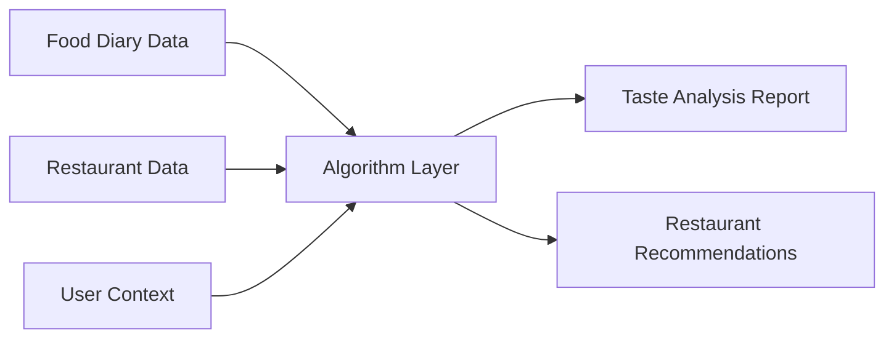
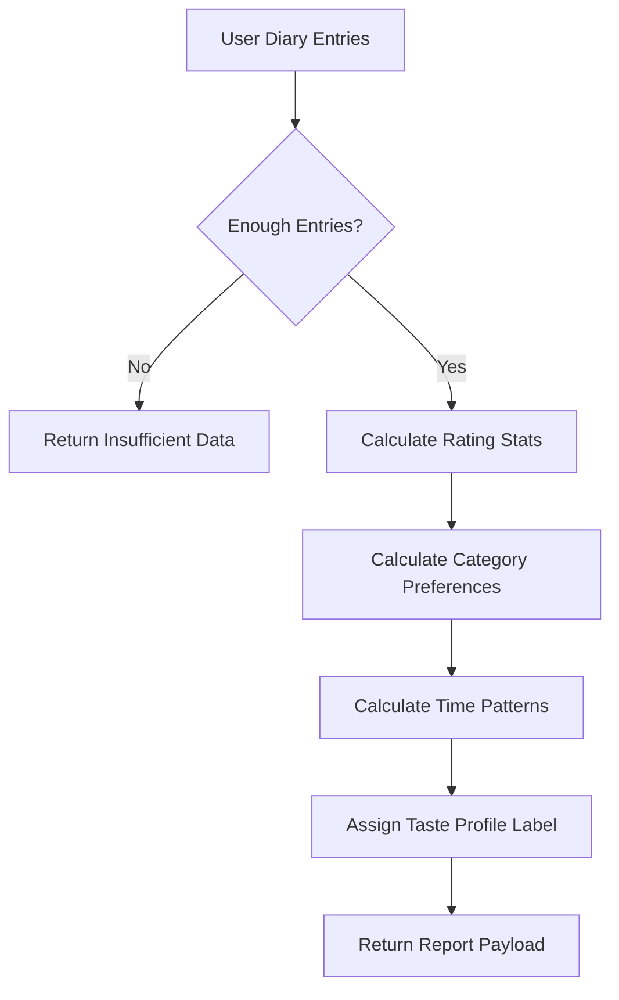
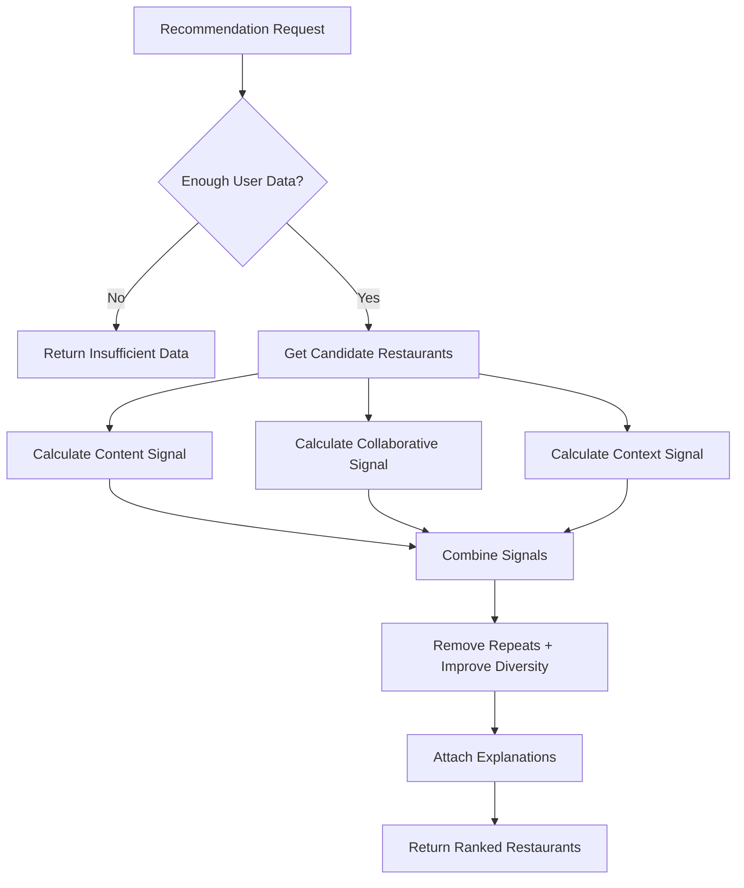

# SnapPlate Algorithm Plan

Owner: Juneha

Scope: two user-facing algorithm features:

1. Taste analysis report.
2. Restaurant recommendation.

Internal tools such as embeddings, profile vectors, collaborative signals, and ranking scores exist only to support these two features.

## 1. Goal

Build the algorithm part of SnapPlate.

The algorithm part should answer two questions:

1. What does this user seem to like?
2. Which restaurants should we recommend to this user?

The frontend and backend are owned by teammates.

This plan only defines what the algorithm layer needs as input, what it produces as output, and how the two algorithm features should work.

## 2. High-Level Flow

The backend stores diaries, restaurants, users, bookmarks, and images.

The algorithm layer reads backend-provided data.

The algorithm layer returns report data and recommendation data.

The frontend displays those results.

## 3. Feature 1: Taste Analysis Report

Purpose:

Show the user a simple summary of their food preferences.

The report should be understandable, visualizable, and stable.

It should not require a complex model in v1.

### Inputs

The taste analysis report needs:

- user id,
- diary entries,
- restaurant category for each diary if available,
- rating,
- comment if available,
- date and time,
- restaurant id or restaurant name,
- location if available.

### Outputs

The taste analysis report should produce:

- total number of diary entries,
- average rating,
- rating distribution,
- top food categories,
- preference score by category,
- visit frequency by category,
- time-of-day pattern,
- taste profile label,
- short explanation text,
- insufficient-data status when there are too few entries.

### Rough Flow

### Notes

This should be deterministic at first.

Use simple statistics before machine learning.

The frontend should receive chart-ready values, not raw intermediate calculations.

If analysis fails, keep the previous successful report if one exists.

## 4. Feature 2: Restaurant Recommendation

Purpose:

Recommend restaurants that fit the user's taste and current context.

The SRS says recommendations should be hybrid:

- content-based,
- collaborative,
- context-based.

For v1, these can be simple signals combined into one ranking process.

### Inputs

Restaurant recommendation needs:

- user id,
- user taste profile from the report,
- user diary history,
- user bookmarks if available,
- current user location,
- restaurant list,
- restaurant category,
- restaurant location,
- restaurant metadata from backend,
- previous recommendation exposure history if available.

### Outputs

Restaurant recommendation should produce:

- ranked restaurant ids,
- explanation for each recommendation,
- reason category for each recommendation,
- insufficient-data status when recommendations cannot be generated,
- no raw score in the client-facing output.

### Rough Flow

### Signal Meaning

Content signal:

Does this restaurant match the user's own diary-based preferences?

Examples:

- preferred category,
- similar restaurant type,
- similar to restaurants the user rated highly.

Collaborative signal:

Do similar users seem to like this restaurant or category?

Examples:

- users with similar taste liked this restaurant,
- users with similar bookmarks visited this kind of place.

If there is not enough cross-user data, this signal can be low-confidence.

Context signal:

Does this recommendation make sense right now?

Examples:

- nearby,
- matches current filters,
- not shown too many times recently,
- fits current time or situation if available.

## 5. Embeddings

Embeddings are internal support for recommendations.

They are not a separate product feature.

Use embeddings only if they help compare:

- user taste profile to restaurants,
- diary entries to restaurants,
- similar restaurants to each other.

Possible vectors:

- diary vector,
- restaurant vector,
- user taste vector.

For v1, text-based embeddings are enough.

Do not make food image understanding required for v1.

## 6. Data Boundary With Backend

The backend should provide:

- diary data for a user,
- restaurant data,
- bookmark data if available,
- exposure history if available,
- storage for generated reports,
- storage for recommendation-related artifacts if needed.

The algorithm layer should provide:

- function or service for generating a taste analysis report,
- function or service for generating restaurant recommendations,
- clear output schema,
- logs for debugging.

The algorithm layer should not handle:

- login,
- permissions,
- file upload,
- image storage,
- map integration,
- frontend rendering.

## 7. Minimum V1

Taste analysis v1:

- total entries,
- average rating,
- top categories,
- category preference scores,
- time-of-day pattern,
- taste profile label,
- short explanation.

Recommendation v1:

- candidate restaurants near the user,
- ranking based on category preference and distance,
- simple collaborative boost when available,
- repeated-recommendation filtering,
- explanation text.

Embeddings v1:

- optional but useful,
- start with restaurant/category/comment text,
- store model version if used.

## 8. Success Criteria

Taste analysis is successful when:

- it produces a report from diary entries,
- it returns insufficient-data status for too few entries,
- chart values are easy for frontend to display,
- results are stable and explainable.

Recommendation is successful when:

- it returns ranked restaurants,
- it includes explanations,
- it avoids obvious duplicates,
- it hides raw scores,
- it responds fast enough for the backend endpoint.

## 9. Suggested Build Order

1. Define input/output schemas with backend teammate.
2. Build taste analysis statistics.
3. Build taste profile label logic.
4. Build recommendation candidate input format.
5. Build simple content/context ranking.
6. Add collaborative signal as a small boost.
7. Add explanations.
8. Add repeated-exposure filtering.
9. Add embeddings if needed.
10. Add tests and sample evaluation data.

## 10. Risks

Collaborative filtering may be weak if there are few users.

Restaurant metadata may be sparse.

Food image understanding may be too hard for v1.

Explanations may be misleading if they are not tied to real signals.

Recommendation quality will depend heavily on diary data quality.

The simplest good v1 is:

- statistics for taste analysis,
- simple hybrid ranking for recommendations,
- embeddings only as support,
- no image model dependency.
