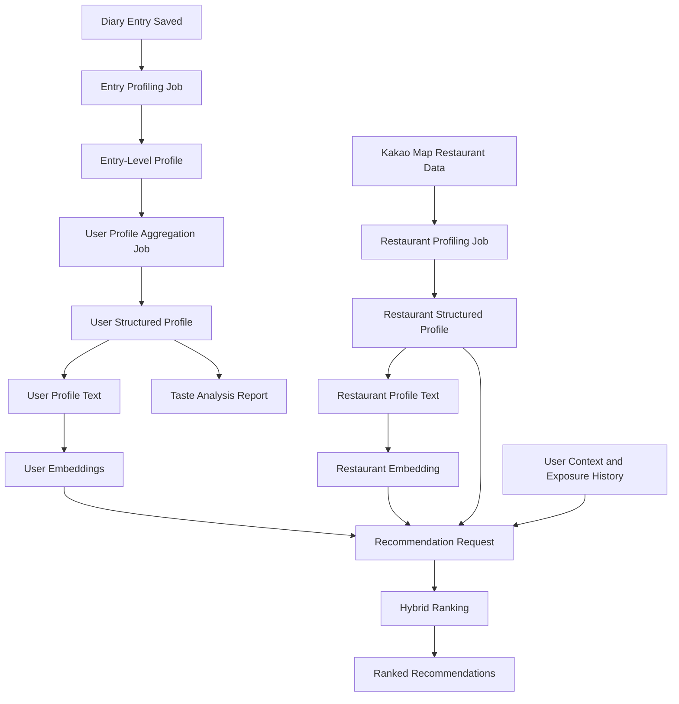
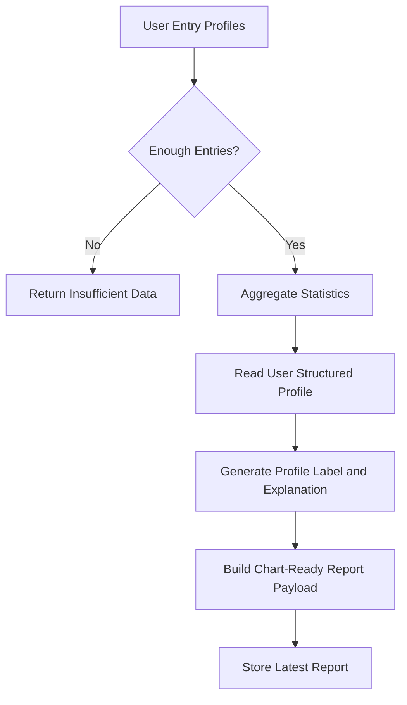
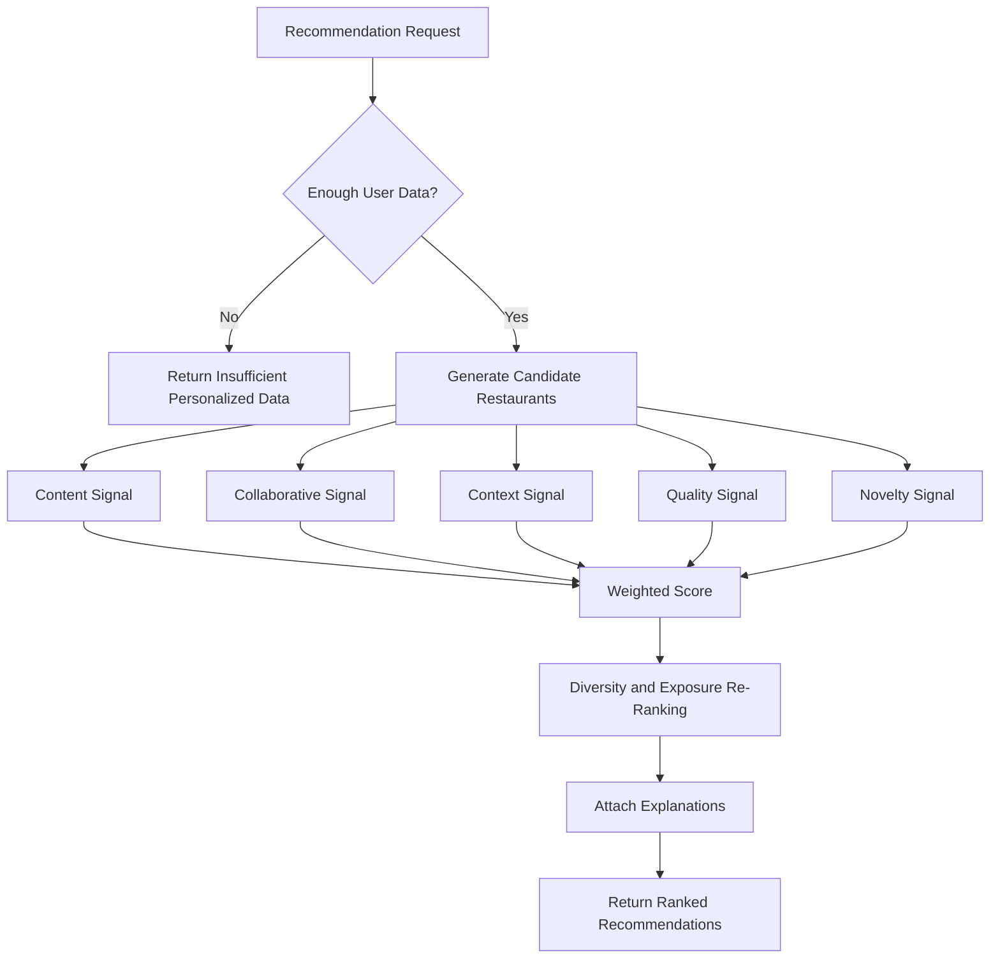

# SnapPlate Algorithm Plan

Owner: Juneha

References:

- `[26S CS350] SRS Team 6.pdf`, especially sections 4.8, 4.9, 5.1, 5.2, 5.4, and 5.5
- `/Users/junehahwang/Downloads/일기 임베딩 및 식당 추천 알고리즘 srs.docx`
- `api-mvp.md`

## 1. Goal

Build the ML-backed algorithm package for SnapPlate.

The algorithm package supports two user-facing features:

1. Taste analysis and profile generation
2. Personalized restaurant recommendations

Internally, these features require four algorithm modules:

1. Food diary entry profiling
2. User taste profile and embedding generation
3. Restaurant profile and embedding generation
4. Hybrid restaurant recommendation ranking

The frontend and backend are owned by teammates. This plan defines the algorithm layer's inputs, outputs, processing flow, storage needs, and integration boundaries.

## 2. Current Decisions

- Build the whole algorithm package, not only a minimal statistics-only version.
- Use ML for text understanding, image understanding, profile generation, and embeddings.
- Use Kakao Map as the official restaurant metadata source.
- Keep the minimum-entry threshold as a configurable constant.
- Keep taxonomy fields adjustable during development.
- Use synthetic dummy users and diaries to test collaborative filtering if real user data is too small.
- External ML APIs are allowed. OpenAI is an acceptable provider candidate.
- Do not expose recommendation scores to users (REQ-BIZ-008).

Resolved client decision:

- Team 6 confirmed that external APIs, including OpenAI, may be used for ML capabilities.
- Exact provider and model IDs should still be configuration values, not hardcoded into algorithm logic.

Required capabilities for the selected provider:

- text-to-structured-profile extraction,
- image-to-structured-profile extraction,
- structured-profile-to-summary-text generation,
- text embedding generation,
- deterministic JSON output or equivalent schema-constrained output.

## 3. Global Configuration

The following values should be defined once in configuration instead of being hardcoded throughout the algorithm:

| Name | Default | Purpose |
| --- | ---: | --- |
| `MIN_ENTRIES_FOR_PERSONALIZATION` | `10` | Minimum diary entries before taste analysis and personalized recommendation outputs are shown |
| `SHORT_TERM_ENTRY_COUNT` | `20` | Number of recent entries used for the short-term profile |
| `SIMILAR_USER_THRESHOLD` | `0.70` | Minimum cosine similarity for collaborative filtering |
| `MIN_SIMILAR_USERS` | `3` | Minimum similar users before collaborative score is active |
| `RECOMMENDATION_LIMIT` | `10` | Default number of recommendations returned |
| `RECOMMENDATION_COOLDOWN_REQUESTS` | TBD | Number of recent recommendation requests used to avoid repeated exposure |
| `ML_PROVIDER` | TBD | External ML provider, for example OpenAI |
| `TEXT_PROFILE_MODEL` | TBD | Model used for diary text profile extraction |
| `IMAGE_PROFILE_MODEL` | TBD | Model used for food image profile extraction |
| `EMBEDDING_MODEL` | TBD | Model used for user and restaurant embeddings |

Internal profiles may be generated before the minimum entry count. User-facing taste analysis and personalized recommendations should return `has_enough_data: false` until the threshold is met (REQ-4.8-015, REQ-4.9-011, REQ-BIZ-002).

## 4. High-Level Flow



Processing should be asynchronous when it can be precomputed. Taste analysis must not block user experience (REQ-4.8-016), and recommendation generation should complete within the SRS performance target (REQ-PERF-012).

## 5. Module A: Food Diary Entry Profiling

Purpose:

Create a normalized entry-level profile from each food diary entry so text, image, location, and time signals can be compared in the same schema.

Related reference:

- Korean DOCX section 4.1
- Supports taste analysis requirement REQ-4.8-001

### Inputs

- `entry_id`
- `user_id`
- diary text or note, if present
- food images, if present
- rating
- captured timestamp
- restaurant id or restaurant name
- restaurant category, if available
- latitude and longitude, if available
- Kakao Map metadata for the restaurant, if available

### Extraction

Text model:

- Extracts `taste`, `context`, and `emotion`.
- Uses diary text, rating, restaurant name, and category as context.

Image model:

- Extracts `food_type` and `cuisine`.
- Uses food images and optional restaurant category as context.

Metadata parser:

- Extracts `location_feature`, `venue`, and `temporal_feature`.
- Uses timestamp, coordinates, address, category, and distance-related metadata.

Missing optional inputs are allowed, but the algorithm must not silently invent values. If a field cannot be extracted, leave it empty or assign low confidence with explicit evidence.

### Entry Profile Schema

```json
{
  "entry_id": "string",
  "user_id": "string",
  "captured_at": "datetime",
  "rating": 4.5,
  "cuisine": { "korean": 0.82 },
  "food_type": { "noodle": 0.76 },
  "taste": { "spicy": 0.66, "savory": 0.81 },
  "context": { "solo_meal": 0.44, "casual": 0.72 },
  "venue": { "casual": 0.70 },
  "emotion": { "satisfied": 0.80 },
  "location_feature": { "near_campus": 0.90 },
  "temporal_feature": { "lunch": 1.0, "weekday": 1.0 },
  "confidence": {
    "cuisine": 0.88,
    "food_type": 0.80,
    "taste": 0.74,
    "context": 0.68,
    "venue": 0.70,
    "emotion": 0.73,
    "location_feature": 0.90,
    "temporal_feature": 1.0
  },
  "evidence": {
    "cuisine": ["image: detected Korean-style stew", "restaurant.category: Korean"],
    "taste": ["text: spicy but balanced"],
    "temporal_feature": ["captured_at: 2026-05-24T12:43:00Z"]
  }
}
```

The field names can change during development, but every extracted field must keep a value, confidence, and evidence path.

## 6. Module B: User Taste Profile and Embeddings

Purpose:

Aggregate many entry-level profiles into a structured user taste profile and long-term/short-term embeddings.

Related reference:

- Korean DOCX section 4.2
- Supports REQ-4.8-003, REQ-4.8-004, and REQ-4.9-001

### Entry Weight

Each entry receives one final weight:

```text
w_i = w_recency * w_richness * w_confidence
```

- `w_recency`: higher for recent entries.
- `w_richness`: higher when the entry has useful text, image, restaurant, rating, location, and time data.
- `w_confidence`: average confidence of key extracted fields.

### Aggregation

The algorithm generates:

- long-term structured profile from all valid entries,
- short-term structured profile from the most recent `SHORT_TERM_ENTRY_COUNT` entries,
- category-rating vector for collaborative filtering,
- profile text from the structured profile,
- long-term embedding,
- short-term embedding.

The recommendation system should use both the structured profile and embeddings. Structured fields are better for explainability and chart output. Embeddings are better for semantic similarity.

### Storage

Store:

- structured user profile,
- profile text,
- long-term embedding,
- short-term embedding,
- category-rating vector,
- source entry count,
- generated timestamp,
- model provider, model name, and model version once provider is decided.

If profile generation fails, preserve the previous successful profile (REQ-SAFE-009).

## 7. Module C: Restaurant Profiling

Purpose:

Normalize Kakao Map restaurant metadata into the same comparison space as user profiles.

Related reference:

- Korean DOCX section 4.3
- Supports REQ-4.9-002 and REQ-SW-007

### Inputs

From backend/Kakao Map:

- restaurant id,
- name,
- category,
- address,
- coordinates,
- rating or quality fields if available,
- review count if available,
- menu or description if available,
- photos if available,
- Kakao place URL or external id.

### Processing

- Parse `cuisine` from Kakao category.
- Parse or infer `food_type` from category, menu, description, and photos.
- Extract limited `taste` and `context` only when metadata supports it.
- Generate `venue` from category and place metadata.
- Generate `location_feature` from coordinates and address.
- Normalize all profile fields to the shared schema.
- Attach confidence and evidence to every generated field.
- Generate restaurant profile text.
- Generate restaurant embedding in the same embedding space as user embeddings.

Restaurant metadata may be sparse. Sparse data should lower confidence instead of creating unsupported profile values.

## 8. Feature 1: Taste Analysis Report

Purpose:

Present the user's food preferences, consumption patterns, and gastronomic profile in a visual and understandable format (REQ-4.8).

### Inputs

- user id,
- entry-level profiles,
- user structured profile,
- ratings,
- diary timestamps,
- restaurant categories,
- restaurant names and ids,
- generated user profile text.

### Outputs

The report should return chart-ready data:

- `has_enough_data`,
- `min_entries_required`,
- `current_entries`,
- `computed_at`,
- total diary entries (REQ-4.8-011),
- average rating and rating distribution (REQ-4.8-006, REQ-4.8-011),
- top N food categories (REQ-4.8-005),
- category preference scores and visit counts (REQ-4.8-003, REQ-4.8-009),
- time-of-day or meal-period pattern (REQ-4.8-007),
- taste/flavor vector when available,
- gastronomic profile label and description (REQ-4.8-004, REQ-4.8-010),
- user-friendly explanation text (REQ-4.8-012),
- insufficient-data response (REQ-4.8-015).

### Flow



Statistics should be deterministic. ML should be used for profile extraction and profile explanation, but visible report numbers should come from traceable entry/profile data.

### Update Behavior

- Trigger analysis after diary creation or edit.
- Run asynchronously (REQ-4.8-016).
- Store the result when complete.
- Notify the user when analysis completes if notifications are enabled (REQ-4.8-014).
- Preserve the previous successful report if a refresh fails (REQ-SAFE-009).

## 9. Feature 2: Restaurant Recommendation

Purpose:

Recommend restaurants that match the user's taste profile, current context, and freshness needs using hybrid recommendation (REQ-4.9).

### Inputs

- user id,
- long-term user embedding,
- short-term user embedding,
- user structured profile,
- category-rating vector,
- user diary history,
- bookmarks if available,
- current location if available,
- active filters if available,
- restaurant profiles,
- restaurant embeddings,
- restaurant quality metadata,
- previous recommendation exposure history.

### Outputs

- ranked restaurant ids (REQ-4.9-007),
- recommendation reason for each restaurant (REQ-4.9-010),
- reason category for each restaurant,
- `based_on_entries`,
- `has_enough_data`,
- insufficient-data response when personalization cannot run (REQ-4.9-011),
- no raw score in the client-facing output (REQ-BIZ-008).

### Flow



### Candidate Generation

Use a union of candidate sources:

- content candidates from user embedding vs restaurant embedding similarity,
- collaborative candidates from similar users,
- context candidates from nearby restaurants, time, distance, and active filters.

This avoids scoring every restaurant on every request.

### Scoring

Base formula:

```text
S(u, r) =
  0.45 * content_score
+ 0.25 * collaborative_score
+ 0.15 * context_score
+ 0.10 * quality_score
+ 0.05 * novelty_score
```

All component scores must be normalized to `[0, 1]`.

Content score:

- Compare user long-term and short-term embeddings with the restaurant embedding.
- Use configurable weights for long-term vs short-term similarity.
- Prefer restaurants whose structured profile also matches high-confidence user profile fields.

Collaborative score:

- Build category-rating vectors from users' diary histories.
- Similar users have cosine similarity at or above `SIMILAR_USER_THRESHOLD`.
- Use similar users' ratings, visits, or bookmarks for the candidate restaurant or its category.
- If fewer than `MIN_SIMILAR_USERS` exist, set collaborative score inactive for that request and log why.

Context score:

- Distance from current user location.
- Active filters.
- Meal time or day-of-week relevance.
- Location feature match.

Quality score:

- Restaurant rating, review count, metadata completeness, and available photo/menu quality if provided by backend.

Novelty score:

- Penalize restaurants recently recommended to the same user.
- Penalize too many near-duplicate restaurants in the same category or area.
- Increase exposure for relevant restaurants the user has not seen before.

### Re-Ranking

After scoring:

- sort by score internally,
- remove repeated restaurant exposure according to cooldown configuration,
- enforce category diversity in the final list (REQ-4.9-008),
- attach reason text based on the strongest real signals,
- store exposure history for future requests.

Scores are for internal ranking only and must not be returned to the client.

### Insufficient Data and Failure Behavior

Insufficient user data:

- return `has_enough_data: false`,
- return empty personalized items,
- let the frontend show an insufficient-data message.

Algorithm or model failure:

- return default nearby/popular restaurants only if the backend product flow requires it (REQ-SAFE-008),
- mark them as non-personalized internally,
- do not present them as personalized recommendations.

## 10. Data Boundary With Backend

The backend should provide:

- diary entries,
- ratings,
- note text,
- image references,
- restaurant ids and metadata,
- Kakao Map metadata,
- user location or request location,
- bookmarks,
- recommendation exposure history,
- persistence for generated profiles, reports, embeddings, and recommendation artifacts.

The algorithm layer should provide:

- entry profile generation,
- user profile and embedding generation,
- restaurant profile and embedding generation,
- taste analysis report generation,
- restaurant recommendation generation,
- trace logs for profile extraction and recommendation scoring (REQ-QA-012).

The algorithm layer should not handle:

- login,
- permissions,
- file upload,
- image storage,
- frontend rendering,
- map UI integration.

### Pinned Backend Contract

The shared Python contract lives in `snapplate_algorithm`.

Public functions:

- `generate_taste_report(user_id, diary_entries) -> TasteProfileResponse`
- `generate_recommendations(user_id, context) -> RecommendedResponse`

Shared Pydantic schemas live in `snapplate_algorithm.schemas`. The client-facing response
models intentionally match the current frontend payloads for `GET /taste/profile` and
`GET /restaurants/recommended`; internal artifacts carry `algorithm_version`, confidence,
evidence, and scoring fields that are stored by the backend but not returned to users.

## 11. Development and Evaluation Data

Collaborative filtering needs multi-user data. If real data is not enough, create synthetic data for development and testing.

Synthetic data should include:

- dummy users with distinct taste profiles,
- diary entries with text, ratings, timestamps, restaurants, and optional images,
- restaurant profiles across several categories and neighborhoods,
- repeated visits and bookmarks,
- enough overlap to test similar-user recommendations.

Synthetic data may be generated with an LLM through the approved external API path. It must be marked as synthetic and kept separate from real user data.

Evaluation checks:

- entry profiles contain confidence and evidence,
- user profiles change when diary history changes,
- similar users are detected in synthetic data,
- recommendations include content, collaborative, context, quality, and novelty signals,
- repeated restaurants are penalized,
- final responses hide raw scores,
- explanations match actual strongest signals.

## 12. Build Order

1. Select exact external API provider and model IDs for text, image, and embedding tasks.
2. Define shared schema, taxonomy starter fields, and global constants with backend.
3. Implement entry-level profile extraction for text, image, metadata, confidence, and evidence.
4. Implement user profile aggregation, long-term/short-term profiles, and embeddings.
5. Implement Kakao Map restaurant profiling and restaurant embeddings.
6. Implement taste analysis report generation from structured profile and statistics.
7. Generate synthetic users, restaurants, and diary data for collaborative filtering tests.
8. Implement candidate generation and hybrid scoring.
9. Implement diversity, novelty, repeated-exposure handling, and explanation generation.
10. Integrate async jobs, persistence, and API payloads with backend.
11. Add tests and evaluation scripts for extraction, aggregation, scoring, and response shape.

## 13. Success Criteria

Taste analysis is successful when:

- it generates profiles from text, image, location, time, and rating data,
- it returns insufficient-data status before the configured threshold,
- it produces chart-ready values for the frontend,
- its profile label and explanation are grounded in stored profile evidence,
- it preserves the previous successful report when a refresh fails.

Recommendations are successful when:

- they use content-based, collaborative, and context-based signals,
- they incorporate quality and novelty,
- they rank restaurants without exposing raw scores,
- they include explanation text tied to real signals,
- they avoid repeated exposure and improve category diversity,
- they can be tested with synthetic users before real data is sufficient,
- they meet the SRS recommendation performance target.

## 14. Risks

- External API cost, latency, quota limits, and privacy handling need to be managed carefully.
- Restaurant metadata from Kakao may be sparse, especially for taste, menu, and image-derived fields.
- Image understanding may be less reliable than text and metadata for some diary photos.
- Collaborative filtering may be weak until enough users exist, so synthetic testing is required during development.
- Explanations can become misleading if they are generated from model guesses instead of actual scoring signals.
- Embedding and extraction outputs can drift when model versions change, so model metadata must be stored.

## 15. Requirement Coverage

| SRS Requirement | Covered By |
| --- | --- |
| REQ-4.8-001 to REQ-4.8-016 | Entry profiling, user profile aggregation, taste analysis report, async refresh |
| REQ-4.9-001 to REQ-4.9-011 | Restaurant profiling, candidate generation, hybrid scoring, re-ranking, explanations |
| REQ-SW-005 | Embedding/vector storage |
| REQ-SW-007 | Kakao Map restaurant data retrieval through backend |
| REQ-SAFE-008 | Default non-personalized fallback on recommendation failure if product requires it |
| REQ-SAFE-009 | Preserve previous successful profile/report on generation failure |
| REQ-PERF-012 | Recommendation generation target under 3 seconds |
| REQ-PERF-013 | Taste analysis target under 30 seconds asynchronously |
| REQ-QA-011 | Configurable recommendation algorithm constants |
| REQ-QA-012 | Traceable analysis and recommendation logs |
| REQ-BIZ-002 | Personalization enabled only after sufficient data |
| REQ-BIZ-008 | Raw recommendation scores not exposed |
| REQ-BIZ-009 | User data used for recommendations not disclosed |
