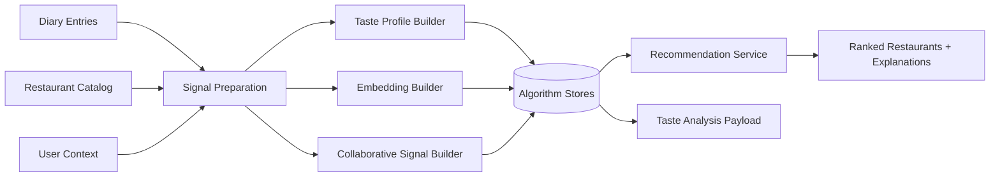
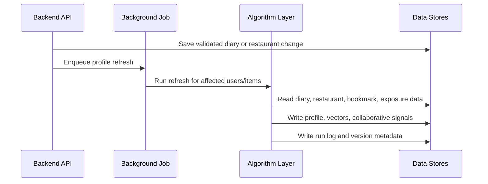
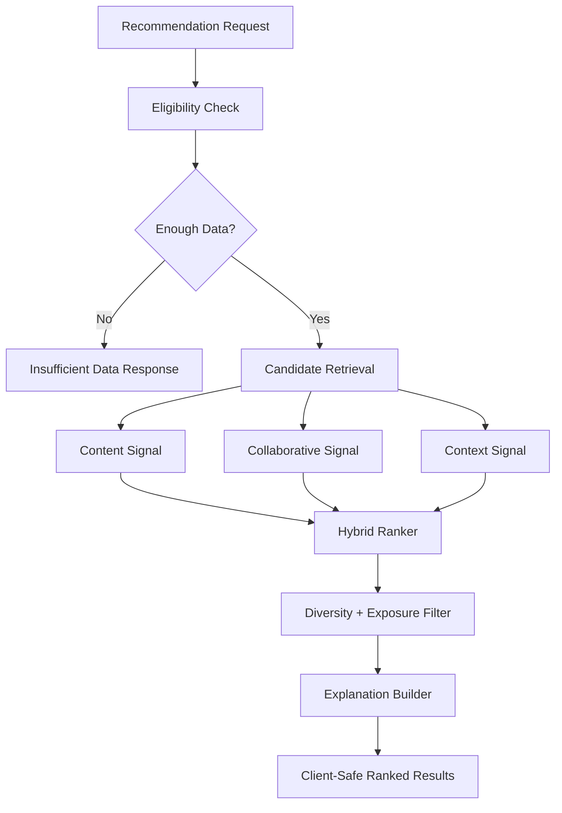

# SnapPlate Algorithm Plan

Scope: taste analysis, recommendation engine, embeddings, and collaborative signals.
Out of scope: frontend screens, backend CRUD, auth UI, upload plumbing, and Kakao API integration.

## 1. Goal

Build the algorithm layer that turns validated diary and restaurant data into taste profiles and restaurant recommendations.

- The layer should be explainable enough for the taste-analysis screen and fast enough for the SRS recommendation target.
- The backend should call it through service boundaries; the frontend should only receive chart-ready analysis data and client-safe recommendation payloads.
- Raw recommendation scores should stay internal.
- Primary outputs are (1) taste summaries, (2) profile labels, (3) vectors, (4) collaborative signals, (5) ranked restaurants, (6) explanations, and (7) logs.

## 2. SRS Alignment

The plan covers REQ-4.8 for taste analysis and profile generation.

- It covers REQ-4.9 for restaurant profiling and hybrid recommendation.
- It supports REQ-SW-005 by producing vector-based analysis artifacts.
- It supports REQ-PERF-012 by keeping online recommendation work under 3 seconds.
- It supports REQ-PERF-013 by running taste analysis asynchronously.
- It supports REQ-QA-011 by making weights and thresholds configurable.
- It supports REQ-QA-012 by logging analysis and recommendation runs.
- It supports REQ-BIZ-002, REQ-BIZ-005, REQ-BIZ-008, and REQ-BIZ-009 by handling insufficient data, limiting duplicates, hiding scores, and protecting user data.

## 3. Team Boundary

- The algorithm layer should not call frontend code directly.
- The frontend should not know ranker weights or internal signal scores.
- The backend should own final API shape, but it should preserve algorithm output fields needed by the client.

## 4. Architecture

The system has an asynchronous profile path and an online recommendation path.
The asynchronous path prepares expensive artifacts after diary, bookmark, or restaurant changes.
The online path reads prepared artifacts and ranks candidates quickly.
Online requests should not rebuild profiles or generate vectors live.

## 5. Inputs

- Diary inputs: `user_id`, `diary_id`, `restaurant_id`, image references, rating, optional comment, date, time, location, created timestamp, and updated timestamp.
- Restaurant inputs: `restaurant_id`, name, category, cuisine tags if available, address, latitude, longitude, Kakao metadata, and cached search metadata.
- User-context inputs: current location, filters, bookmarks, exposure history, existing taste profile, existing user vector, and existing collaborative signals.
- Cross-user inputs: anonymized rating behavior, visit behavior, bookmark behavior, and restaurant popularity among similar users.
- Derived inputs: previous analysis result, previous vector version, previous recommendation batch, and last successful algorithm run metadata.

## 6. Outputs

- Taste-analysis outputs: diary count, average rating, rating distribution, top categories, category preference scores, visit frequency, time-of-day pattern, profile label, chart values, summary text, and insufficient-data status.
- Embedding outputs: diary vectors, restaurant vectors, user taste vector, embedding model version, vector source timestamp, and vector refresh timestamp.
- Collaborative outputs: similar-user signals, similar-item signals, collaborative confidence, refresh timestamp, and insufficient-collaborative-data status.
- Recommendation outputs: ordered restaurant ids, display-safe explanations, reason categories, recommendation batch id, insufficient-recommendation status, and no client-facing raw score.
- Logging outputs: run id, run type, input counts, config version, artifact version, duration, success status, and failure reason.

## 7. Async Profile Flow

Async triggers should include diary create, diary edit, diary delete, bookmark change, restaurant metadata change, and scheduled refresh.
If a refresh fails, preserve the previous profile or vector and log the failure.
The backend can retry the job; the algorithm layer should make repeated runs deterministic for the same input snapshot.

## 8. Online Recommendation Flow

Online work should validate eligibility, retrieve candidates, combine signals, apply repeated-exposure limits, diversify results, attach explanations, and return ranked restaurants.
The ranker may compute internal scores, but the response to frontend must not include them.

## 9. Taste Analysis Component

Taste analysis should be deterministic and explainable. 

- Use statistics before opaque ML: category preference, rating distribution, visit frequency, recency, and time-of-day patterns.
- The profile label should come from stable rules over dominant preference patterns.
- The taste screen should receive normalized chart values and short explanatory text.
- Minimum useful fields are top categories, average rating, total entries, rating distribution, time-of-day pattern, and profile label.
- If the user has too few entries, return insufficient-data status instead of weak analysis.

## 10. Embedding Component

- Embeddings should support semantic matching between diary entries, restaurants, and users.
- Diary embedding text can combine restaurant name, category, comment text, food tags, and possibly a coarse rating bucket.
- Restaurant embedding text can combine restaurant name, category, cuisine tags, menu or description, and location-independent metadata.
- The user taste vector should be derived from diary vectors, with higher-rated entries weighted more heavily.
- Recent entries may receive more weight, but the recency weight should be configurable.
- Every vector should store model version, source timestamp, and refresh timestamp.

## 11. Collaborative Signal Component

Collaborative filtering is required by the SRS hybrid recommendation section.

- Useful signals include similar category preferences, similar restaurant ratings, similar bookmarks, restaurants liked by similar users, and restaurant co-occurrence in user histories.
- If shared behavior is sparse, return low collaborative confidence and let content/context signals dominate.
- Cold-start users should still receive content/context recommendations.
- Cold-start restaurants should still be eligible through restaurant metadata and location.
- Collaborative explanations must stay aggregated, such as "popular among users with similar taste", without exposing private user behavior.

## 12. Hybrid Recommendation Component

The ranker combines content-based, collaborative, and context-based signals.

- Content signal compares user profile or vector against restaurant attributes and vectors.
- Collaborative signal uses similar-user and similar-item artifacts with a confidence value.
- Context signal uses current location, distance, filters, time context, and exposure history.
- After ranking, apply duplicate limits, diversity constraints, and explanation selection.
- Candidate retrieval should happen before scoring so the system does not scan every restaurant at scale
- Candidate sources can include nearby restaurants, preferred-category matches, vector-similar restaurants, restaurants liked by similar users, and relevant bookmarked restaurants.
- Candidates should be deduplicated before ranking and logged by count.

## 13. Explanation Plan

Each recommendation should include one display-safe reason.

- Reason categories can include category match, similar to highly rated entries, nearby option, popular among similar users, fits current filters, and not recently shown.
- Explanations should be tied to the dominant signal used for ranking.
- Explanations should not include raw scores or private cross-user data.
- Explanations should be stable enough for tests.

