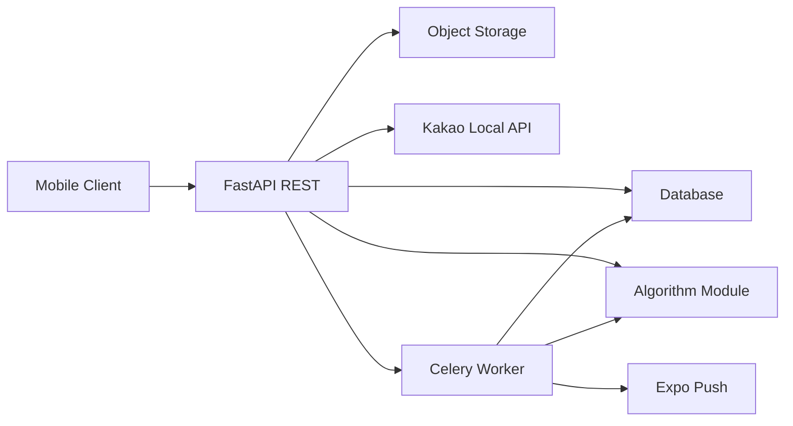

# SnapPlate Backend Plan

Owner: Minjae

Scope: backend service for SnapPlate v1.0.

The frontend and algorithm layer are owned by teammates.

## 1. What SnapPlate Is

A mobile app where users take photos of food, write short diary entries about restaurants, and get personalized restaurant recommendations.

Unlike Yelp or Google Maps, recommendations are driven by the user's own diary, not by aggregated crowd ratings.

That single product idea is what shapes everything the backend has to do.

## 2. What the Backend Has to Do

To make that product work, the backend needs roughly five big things:

1. **A way for users to sign in and own their data.**
2. **A place to store structured data** — users, diaries, bookmarks, restaurants.
3. **A place to store images and serve them safely.**
4. **A way to talk to Kakao** for restaurant data and cache the results.
5. **A way to run slow work in the background** — taste analysis, image processing, push notifications — without blocking the user.

Everything in the stack falls under one of those five.

Taste analysis and recommendation logic lives inside the backend as normal service
modules. It is not a separate service or sibling package in v1.

## 3. High-Level Flow



Mobile talks only to FastAPI. FastAPI owns the database, the storage layer, and external service calls. Celery handles work that's too slow for a request.

## 4. The Stack

### Full picture

| Layer | Option 1 (Self-Hosted) | Option 2 (Supabase) |
|---|---|---|
| Language | Python 3.11+ | Python 3.11+ |
| Web framework | FastAPI | FastAPI |
| Validation | Pydantic v2 | Pydantic v2 |
| Config | pydantic-settings | pydantic-settings |
| ORM | SQLAlchemy 2.0 async | SQLAlchemy 2.0 async |
| DB driver (API) | asyncpg | asyncpg |
| DB driver (workers) | psycopg2-binary | psycopg2-binary |
| Migrations | Alembic | Alembic |
| **Relational DB** | **Postgres 16 (Docker → Neon)** | **Supabase Postgres** |
| **Vector store** | **pgvector** | **pgvector** |
| **Auth** | **fastapi-users + PyJWT + passlib** | **Supabase Auth, verified with PyJWT** |
| **Image storage** | **MinIO (dev) → Cloudflare R2 (demo), aioboto3** | **Supabase Storage, supabase-py** |
| **CDN** | **Cloudflare via R2** | **Supabase edge** |
| Image processing | Pillow | Pillow |
| HTTP client | httpx | httpx |
| Retries | tenacity | tenacity |
| Job queue | Celery | Celery |
| Broker | Redis | Redis |
| Restaurant API | Kakao Local REST | Kakao Local REST |
| Embeddings (optional) | OpenAI text-embedding-3-small | OpenAI text-embedding-3-small |
| Push | Expo Push (exponent-server-sdk-python) | Expo Push (exponent-server-sdk-python) |
| Testing | pytest + pytest-asyncio + httpx.AsyncClient | pytest + pytest-asyncio + httpx.AsyncClient |
| Lint + format | ruff | ruff |
| Type check | pyright | pyright |
| Deps | uv | uv |
| Local dev | docker-compose: db + redis + minio + api + worker | docker-compose: redis + api + worker + cloud Supabase |
| Demo deploy | Fly/Railway + Neon + Upstash + R2 | Fly/Railway + Supabase |

The bolded rows are the ones that actually differ between options. Everything else is identical.

The subsections below explain what each layer is for and why we picked what we picked.

### 4.1 Web layer

We need a REST API that talks async to the database, Kakao, and OpenAI, and that can import the algorithm layer in-process.

- **Python 3.11+ and FastAPI.**
- **SQLAlchemy 2.0 (async)** as the ORM, **asyncpg** as the driver, **psycopg2-binary** for Celery workers (which run sync code).
- **Alembic** for versioned migrations so the team isn't stuck dropping each other's databases.
- **Pydantic v2** for validation (bundled with FastAPI), **pydantic-settings** for env-var-driven config.

### 4.2 Database

We need a relational store for users / diaries / bookmarks / restaurants, plus a vector store for similarity-based recommendations.

- **Postgres 16.** ACID transactions, Row-Level Security (REQ-SEC-005), JSONB for Kakao's raw payload.
- **pgvector** as a Postgres extension instead of a separate vector DB. At our scale (~10k restaurant vectors) running OpenSearch or Pinecone is overkill — pgvector lets the recommendation query be one SQL statement.

Where the Postgres instance actually runs is option-dependent (see §5).

### 4.3 Authentication

Users sign in, the backend verifies them, and every endpoint enforces "you only see your own data."

We use JWT either way: mobile holds a token, backend verifies the signature, the `sub` claim becomes the request's `user_id`. The thing that changes between Option 1 and Option 2 is **who issues that JWT**.

- Option 1: we issue it ourselves with `fastapi-users` + `PyJWT` + `passlib`.
- Option 2: Supabase Auth issues it, we just verify.

### 4.4 Image storage

Images live separately from the database (REQ-SW-006). Postgres rows hold storage keys; the bytes live in object storage. We mint signed URLs (15-min TTL) for authenticated access (REQ-SEC-009).

We need an S3-compatible object store either way. Which one is option-dependent (see §5).

We use **Pillow** in a Celery task for:
- stripping EXIF GPS before upload (REQ-SEC-008),
- reading EXIF timestamp and GPS for diary metadata (REQ-4.5-005),
- generating thumbnail + medium variants so the diary list hits its 2s budget (REQ-PERF-009),
- rotating images by EXIF orientation.

### 4.5 External integrations

- **Kakao Local REST API** for restaurant data. REQ-BIZ-010 fixes the map service to Kakao. Three endpoints in use: keyword search, category search (`FD6`), coord-to-address. 100k requests/day per endpoint is comfortable.
- **OpenAI `text-embedding-3-small`** as the embedding provider, *if* the algorithm layer decides to use embeddings. ~$0.02 per 1M tokens.
- **Expo Push Notifications** for "your taste analysis is ready" (REQ-4.8-014). One HTTP POST, no APNs cert setup.
- **httpx** for all outbound HTTP, **tenacity** for exponential-backoff retry. REQ-4.2-011 requires Kakao calls to fall back to cache on failure.

### 4.6 Background jobs

Two pieces of work can't run inside a request:

- Taste analysis takes seconds to tens of seconds (REQ-PERF-013 budgets 30s async).
- Image variant generation is CPU-bound and would block the event loop.

- **Celery** for the task framework.
- **Redis** as the broker (lightweight, one container).

Job inventory:

- `analyze_diary(diary_id)` — fires on diary upsert, calls algorithm, stores report.
- `generate_image_variants(image_id)` — Pillow thumb/medium after upload.
- `refresh_kakao_cache(grid_key)` — periodic stale-while-revalidate.
- `send_push_notification(user_id, payload)`.
- `cleanup_deleted_accounts()` — daily hard-delete past 30-day grace.

### 4.7 Dev toolchain

- **uv** for fast deps + lockfile.
- **ruff** for lint and format.
- **pyright** for type checks.
- **pytest + pytest-asyncio + httpx.AsyncClient** for tests against in-process FastAPI.

## 5. The Two Options

Most of the stack is fixed by §4. Three things still hinge on a single decision: **do we self-host the data layer, or use Supabase?**

What differs: who hosts Postgres, who issues the JWT, and where image bytes live. Everything else — FastAPI handlers, models, migrations, Celery tasks, Kakao + OpenAI + Expo integration, Pillow — is identical.

### Option 1 — Self-Hosted

```
Postgres:       Docker (pgvector/pgvector:pg16) for dev
                Managed Postgres (Neon) for demo
Auth:           fastapi-users + PyJWT + passlib[bcrypt]
                We own signup / login / refresh / reset endpoints
Image storage:  MinIO (dev, Docker) → Cloudflare R2 (demo)
                aioboto3 (S3-compatible SDK)
CDN:            Cloudflare via R2 (demo) / none (dev)
RLS:            Manually inject app.user_id per request transaction
JWT secret:     Our own key, env var
Local dev:      docker-compose up → db + redis + minio + api + worker
```

**Pros**
- Full stack in one `docker-compose up`. Every dev has an identical environment.
- No shared cloud project. Schema iteration is independent per dev.
- No vendor lock-in, no demo-day outage risk from a third party.
- Higher learning value.

**Cons**
- Two to three days of Week 1 spent on auth and storage plumbing before any feature code.
- We own backups, container health, and email flows.
- No OAuth or magic links out of the box (`fastapi-users` covers email/password only by default).
- More moving parts to keep running.

### Option 2 — Supabase

```
Postgres:       Supabase managed (pgvector pre-enabled)
Auth:           Supabase Auth (mobile uses supabase-js)
                FastAPI verifies JWT with PyJWT + Supabase JWT secret
Image storage:  Supabase Storage (private bucket)
                supabase-py for signed URLs
                Built-in image transforms (?width=200) — may skip Pillow for resize
CDN:            Supabase edge (built-in)
RLS:            Built-in auth.uid() helper, or skip RLS and enforce in FastAPI
JWT secret:     Supabase-issued, env var
Local dev:      docker-compose (redis + api + worker) + cloud Supabase
```

**Pros**
- Auth works on Day 1 — about 30 lines of JWT-verify middleware.
- Image storage works on Day 1 — one SDK call for a signed URL.
- Free tier fits the project: 500MB DB, 1GB storage, 50k MAU.
- No backups, no email infra, no certs to manage.
- More Week 1 time on actual features.

**Cons**
- Vendor dependency. Supabase outage = demo down (uptime is fine in practice).
- One shared cloud project per environment; devs can step on each other's data unless they each spin up a free-tier project.
- Slightly less "we built it all" depth.
- RLS via `auth.uid()` only works if we set per-request session variables — otherwise we skip RLS and enforce ownership in app code.

### What's identical either way

Roughly 90% of the code:

- FastAPI handlers and routers
- SQLAlchemy models and Alembic migrations
- Celery tasks
- Kakao integration and caching
- OpenAI embedding calls
- Pillow EXIF handling (still needed for privacy even with Supabase transforms)
- Expo push calls
- Pydantic schemas
- Test suite

The three things that actually differ:

1. Auth library and endpoints.
2. Storage SDK.
3. Local dev compose file.

## 6. Boundary with Taste and Recommendation Logic

The algorithm logic is backend-owned code under `app.services.algorithm`, with
internal Pydantic contracts under `app.schemas.algorithm`. It is not a separate
service or sibling Python package.

Two entrypoints (defined together with Juneha):

- `generate_taste_report(user_id, diary_entries, profile_provider) -> TasteProfileResponse`
- `generate_recommendations(user_id, context) -> RecommendedResponse`

Each result carries an `algorithm_version` stored with the row.

Trigger points:

- Diary create or update enqueues a Celery task → `generate_taste_report` → stored in `taste_reports`.
- `/recommendations` calls `generate_recommendations` synchronously, with the last stored report as input. On failure, return the most recent stored result.

The pure scoring/profiling functions do not touch the database directly. Backend
services read diary data, call the algorithm functions, and store the result.

## 7. Performance Targets

From SRS §5.1:

- Restaurant search ≤ 200ms at DB level, ≤ 1s including Kakao.
- Diary list retrieval ≤ 2s with thumbnails.
- Recommendation generation ≤ 3s synchronous.
- Taste analysis ≤ 30s asynchronous.
- ≥ 100 concurrent users.

Mitigations: cursor pagination, indexed foreign keys, image variants generated once at upload, Kakao response cache.

## 8. Build Order

1. Scaffold FastAPI, SQLAlchemy, Alembic, Celery.
2. Decide Option 1 vs Option 2.
3. Schema + migrations for users, diaries, restaurants, bookmarks.
4. Auth wiring + `/users/me`.
5. Kakao integration + `/restaurants`.
6. Image upload + `/diaries` CRUD.
7. `/bookmarks`.
8. Pin algorithm contract with Juneha.
9. `/taste` + diary trigger.
10. `/recommendations`.
11. Push notifications + `/notifications`.
12. Seed data, tests, polish.

## 9. Success Criteria

- The mobile client can complete the demo flow end to end.
- Restaurant search returns within the SRS performance budget.
- Diary creation works with images, EXIF stripping, and offline retry from the client.
- The algorithm layer can read diary data and store its results.
- Account deletion respects the 30-day grace period.
- Every endpoint enforces ownership of the underlying data.
- No secrets in the repo.

## 10. Risks

- Kakao developer signup may stall on SMS verification. One-person dependency.
- Algorithm contract drift if the schema isn't pinned before week 2.
- Image egress on demo day if many testers hit the app at once.
- Vendor outage (Option 2) vs ops burden (Option 1).
- Privacy boundary if OpenAI embeddings are enabled on user-generated text.
- Korean text search quality from Postgres FTS may be weaker than OpenSearch with Nori. Deferred for v1.

## 11. Open Questions

- Option 1 vs Option 2: not yet picked.
- Embeddings: yes, no, or deferred. Depends on Juneha's v1.
- Demo deployment target: depends on course logistics.
- RLS: enforce in Postgres or in FastAPI middleware. Lean toward middleware for v1.
- Push token lifecycle: how aggressively to clean up tokens after logout or uninstall.

The simplest good v1 is:

- one stack option locked early,
- schema and Kakao caching done in week 1,
- diary and image flow done in week 2,
- algorithm integration and recommendation feed done in week 3,
- embeddings only if the algorithm layer asks for them.

## Appendix A — Data Model Sketch

The shape will firm up during week 1; the SRS already implies these tables.

- `users`: id, email, nickname, profile_image_url, taste_type, created_at, deleted_at
- `diaries`: id, user_id, restaurant_id (nullable), rating, comment, eaten_at, location, created_at
- `diary_images`: id, diary_id, user_id, storage_key, variant, position, exif_taken_at
- `restaurants`: id (= kakao_place_id), name, category, address, x, y, raw_payload, fetched_at
- `bookmarks`: id, user_id, restaurant_id, created_at  (unique on user_id + restaurant_id)
- `taste_reports`: id, user_id, payload_json, algorithm_version, generated_at
- `recommendation_exposure`: id, user_id, restaurant_id, shown_at, reason
- `push_tokens`: id, user_id, expo_token, platform, created_at

Optional, only if the algorithm layer needs them:

- `user_embeddings`: user_id, vector(d), kind, updated_at
- `restaurant_embeddings`: restaurant_id, vector(d), model_version, updated_at

Invariants:

- `kakao_place_id` is the canonical restaurant identifier. The backend never invents restaurant IDs.
- Bookmarks unique per (user_id, restaurant_id). REQ-4.3-002.
- Account deletion is soft for 30 days. REQ-4.1-009.
- No future-dated diary entries. REQ-BIZ-006.
- User data accessible only by the owner. REQ-SEC-004.

## Appendix B — REST API Sketch

Final shape will be driven by the mobile screens and the algorithm contract.

- Prefix: `/api/v1`.
- Auth: Bearer JWT in the `Authorization` header.
- Error format: `{ "detail": "...", "code": "..." }`.
- Pagination: cursor-based for diary and restaurant lists.

Endpoint groups:

- `/auth/*` — Option 1 only. Option 2 uses Supabase client on mobile.
- `/users/me` — profile read, update, delete.
- `/restaurants` — search, nearby, by-id. Proxies to Kakao with cache.
- `/bookmarks` — add, remove, list.
- `/diaries` — CRUD + list with cursor.
- `/images` — multipart upload, signed URL on read.
- `/taste` — latest taste analysis report.
- `/recommendations` — ranked restaurant feed.
- `/notifications` — register / unregister push token.
- `/health` — liveness + readiness.

Each endpoint ties back to one or more REQ-IDs from the SRS.
